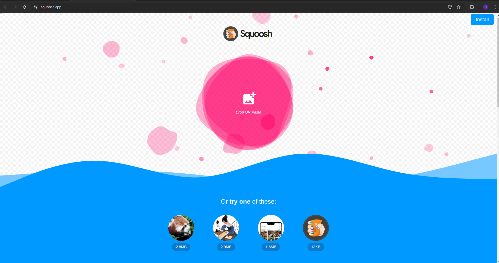

# Recursos web
## Maquetado de colores

## Imágenes
### squoosh 
Es una herramienta en línea gratuita que permite optimizar imágenes para la web. Su propósito principal es reducir el tamaño de los archivos de imagen sin sacrificar demasiado la calidad visual. Algunas de las características y funcionalidades de Squoosh incluyen:
1. Compresión de Imágenes: Permite elegir diferentes métodos de compresión, ajustando la calidad y el tamaño de la imagen.

2. Visualización en Tiempo Real: Muestra una comparación en tiempo real entre la imagen original y la comprimida, lo que facilita ver cómo se ve el archivo después de la optimización.

3. Soporte para Varios Formatos: Admite varios formatos de imagen, como JPEG, PNG, WebP y otros, lo que proporciona flexibilidad en la elección del formato más adecuado para las necesidades del usuario.

4. Interfaz Intuitiva: La interfaz es fácil de usar, lo que permite a los usuarios arrastrar y soltar imágenes y ajustar configuraciones sin complicaciones.

5. Sin Necesidad de Registro: No es necesario registrarse o descargar software, lo que lo convierte en una opción conveniente para usuarios que necesitan optimizar imágenes de manera rápida.

    <a href="https://squoosh.app/">https://squoosh.app/</a>

### Material Design guide
[https://m3.material.io/](https://m3.material.io/)

### Developer Apple Design
[https://developer.apple.com/design/](https://developer.apple.com/design/)